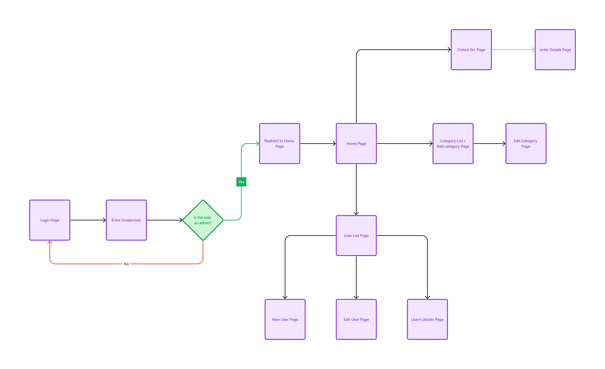

# E-commerce Website Admin Dashboard

## Overview

This E-commerce Website Admin Dashboard allows admins to monitor, add, delete, and edit the inventory of the e-commerce website. Additionally, admins can add users and grant admin access to other users. The dashboard provides essential statistics on Total Users, Total Orders, Total Sales, and Total Products.

## Pages Overview

- Home Page
  Displays overall statistics such as Total Users, Total Orders, Total Sales, and Total Products to provide a quick overview.

- Users Page
  Displays a list of all registered users on the e-commerce website for admin monitoring and management.

- Products Page
  Displays a list of all products available on the website, allowing admins to view and manage the product inventory.

- Categories Page
  Shows a list of all defined product categories. Admins can also use a form to add new categories if needed.

- Orders Page
  Provides a comprehensive list of all orders for admin review and management.

- Edit Product Page
  Allows admins to edit and modify product details, including updating product information.

- Edit User Page
  Enables admins to edit and modify user data, such as account details and permissions.

- Edit Category Page
  Allows admins to edit existing categories or add new properties to a specific category.

- Order Details Page
  Displays detailed information about a specific order, including order items, payment details, and shipping information.

- New Product Page
  Provides a form for admins to add new products to the inventory of the e-commerce website.

- New User Page

Allows admins to add new users to the system and assign appropriate permissions, including granting admin access.

## Technology Stack

The E-commerce Website Admin Dashboard is built using the following technologies:

- React with Vite: Frontend framework for building the user interface efficiently.
- Tailwind CSS: Utilized for styling the dashboard interface with a utility-first approach.
- React Router DOM: Facilitates seamless navigation and routing within the admin dashboard.
- Redux Toolkit: Manages the application state, including user data and permissions.
- Axios: Handles API calls to interact with the server-side for managing data effectively.
- Installation Process
- To run the E-commerce Website Admin Dashboard on your local device, follow the steps below:

## Prerequisites

Node.js and npm should be installed on your local device.

## Steps

**Clone the Repository**


```git clone https://github.com/your-username/your-repository.git```

**Navigate to the Project Directory**

```cd your-repository```

Install Dependencies
```npm install```

Start the Development Server

```npm run dev```

Access the Admin Dashboard

Open your web browser and go to http://localhost:5174 to access the E-commerce Website Admin Dashboard running on your local device.

## The Basic Work Flow of This website

