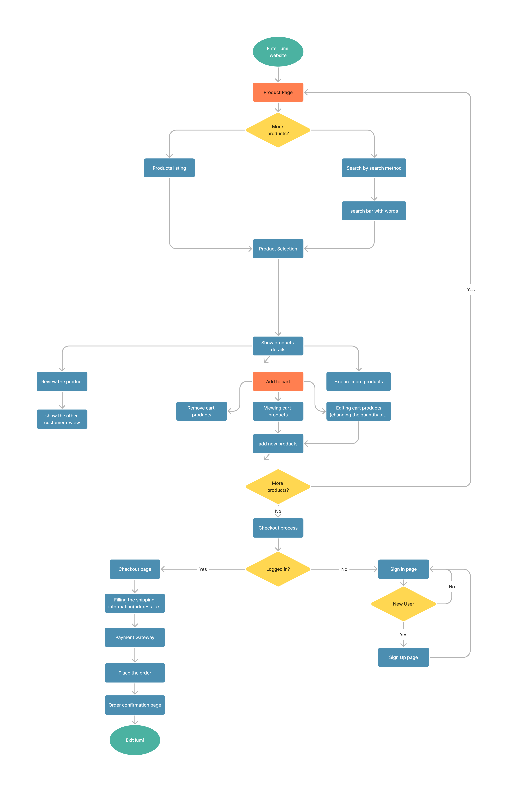

# Online E-commerce Platform

## Overview

This React Vite-based e-commerce platform allows users to browse the latest produts, view featured products, manage their accounts, make secure payments, and place orders conveniently. The project utilizes various technologies including React, Redux Toolkit, Tailwind CSS, Styled-Components, Axios for API calls, React Router DOM for routing, and the Cashfree payment gateway for secure payment processing.

## Project Pages

- Home Page
    Displays the latest projects and features a specific product.

- All Products Page
    Provides a comprehensive list of all available products.

- Accounts Page
    Enables users to manage their accounts, including profile information and preferences.and placed-orders list

- Order details Page
    Display order the respective order details

- Login Page
    Allows users to securely log into their accounts.

- Register Page
    Facilitates new user registration and account creation.

- Cart Page
    Allows users to place orders and make payments securely through the Cashfree payment gateway.
Technology Stack

## The project is built using the following technologies:

- React: Main framework for building the user interface.
- Redux Toolkit: Manages the user and cart state efficiently.
- Tailwind CSS: Provides utility-first CSS for styling the application.
- Styled-Components: Enables styling components with scoped styles for better maintainability.
- Axios: Handles API calls for efficient data retrieval and updates.
- React Router DOM: Facilitates seamless navigation and routing within the application.
- Cashfree Payment Gateway: Ensures secure and efficient payment processing.

## Installation Process

To run this project on your local device, follow the steps below:

## Prerequisites

Node.js and npm should be installed on your local device.

## Steps

**Clone the Repository**

`git clone https://github.com/your-username/your-repository.git`

**Navigate to the Project Directory**

`cd your-repository`

**Install Dependencies**

`npm install`

**Set Up Environment Variables**

Create a `.env` file at the root of the project.
Add the necessary environment variables such as API keys, endpoints, and other sensitive information required for the project to function properly.
Start the Development Server

`npm run dev`

Access the Application

Open your web browser and go to http://localhost:3000 to access the application running on your local device.

## The Basic Work Flow of This website

