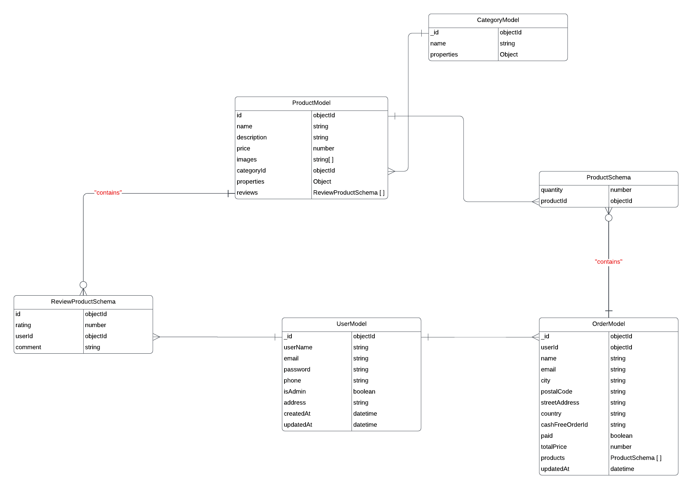

# Node.js Express Server with MongoDB and Additional Features

## Overview

This repository contains the implementation of a Node.js server using the Express framework, MongoDB for the database, bcryptjs for password encryption, JWT tokens for access token generation and verification, and Cashfree for payment generation and verification.

# Installation Process

To run this project on your local device, follow the steps below:

## Prerequisites

Node.js and npm should be installed on your local device.

## Steps

**Clone the Repository**

`git clone https://github.com/aasimtaif/Ineuron-InternShip.git`

**Navigate to the Project Directory**

`cd server`

**Install Dependencies**

`npm install`

**Set Up Environment Variables**

Create a `.env` file at the root of the project.
Add the necessary environment variables such as API keys, endpoints, and other sensitive information required for the project to function properly.
Start the Development Server

`npm start`

Access the Application

Open your web browser and go to http://localhost:8800 to access the application running on your local device.

Initialize the Express app, set up middleware, and connect to MongoDB.
Implement user authentication and authorization with bcryptjs for encryption, JWT for access tokens, and user-protected and admin-protected routes for user and admin-specific functionality.
Integrate Cashfree for payment generation and verification.

## API Endpoints

**User Authentication:**

POST `/api/auth/register` - Register a new user
POST `/api/auth/login` - User login and token generation

**User Management:**
GET `/api/users`- Get all users (admin-protected route)
GET `/api/users/:id` - Get a specific user (admin-protected route)
PUT `/api/users/:id` - Update user information (user-protected route)
DELETE `/api/users/:id` - Delete a user account (admin-protected route)

**Product Management:**
GET `/api/products`- Get all products
GET `/api/products/:id` - Get a specific product
GET `/api/products/new-products` - Get new products
GET `/api/products/featured` - Get featured product
GET `/api/products/search` - Get searched Products
POST `/api/products/` -Post new Product(admin-protected route)
PUT `/api/products/:id` - Update product information (admin-protected route)
PUT `/api/products/reviews/:id` - add review of product (user-protected route)
DELETE `/api/products/:id` - Delete a product (admin-protected route)
DELETE `/api/products/image/:id` - Delete a specific photo of a product (admin-protected route)

**Category Management:**
GET `/api/categories/`- Get all categories (admin-protected route)
GET `/api/categories/find/:id` - Get a specific category (admin-protected route)
GET `/api/categories/search` - Get searched categories (admin-protected route)
POST `/api/categories/` - Post new category (admin-protected route)
PUT `/api/categories/:id` - Update category (admin-protected route)
DELETE `/api/categories/:id` - Delete a category (admin-protected route)

**Order Management:**
GET `/api/orders/`- Get all orders (admin-protected route)
GET `/api/orders/:id` - Get all orders of a specific user (user-protected route)
GET `/api/orders/order/:id` - Get a order (user-protected route)

**Payment Processing:**

POST `/api/payment/checkout` - Generate a payment link
POST `/api/payment/verify` - Verify the payment status

Middleware
Auth Middleware - Verifies the user's access token in the request header and matches it with the user's ID or admin for user-protected routes.
Admin Middleware - Restricts access to admin-specific API endpoints.

That's a brief introduction to the Node.js server with Express, MongoDB, and additional features. Further details about the routes, middleware, and server setup can be found in the codebase.

For additional details about the implemented API endpoints, middleware, or server setup, please refer to the source code.

## ER Diagram Of The DataBase

